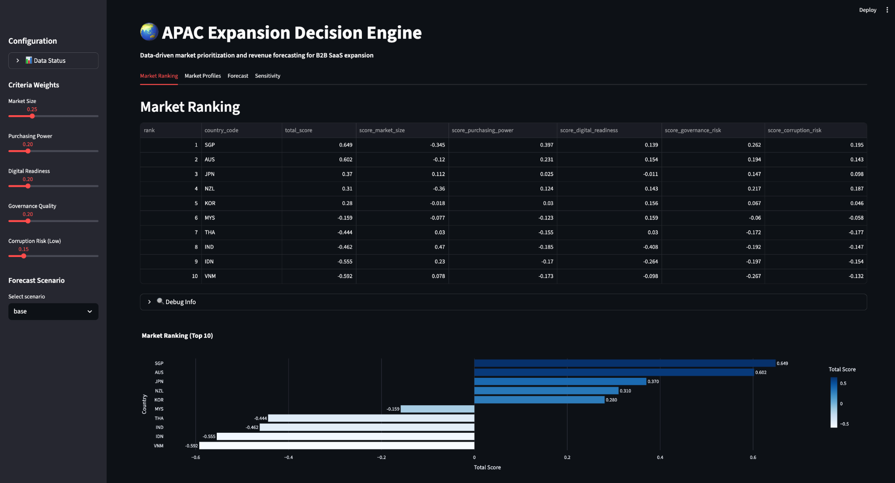
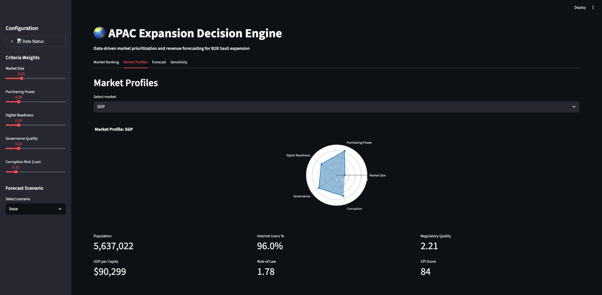
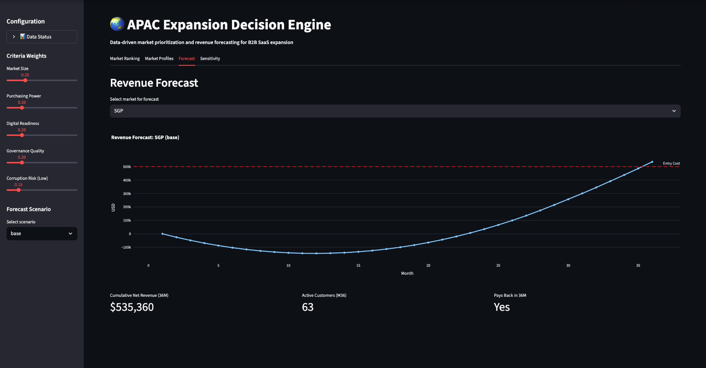
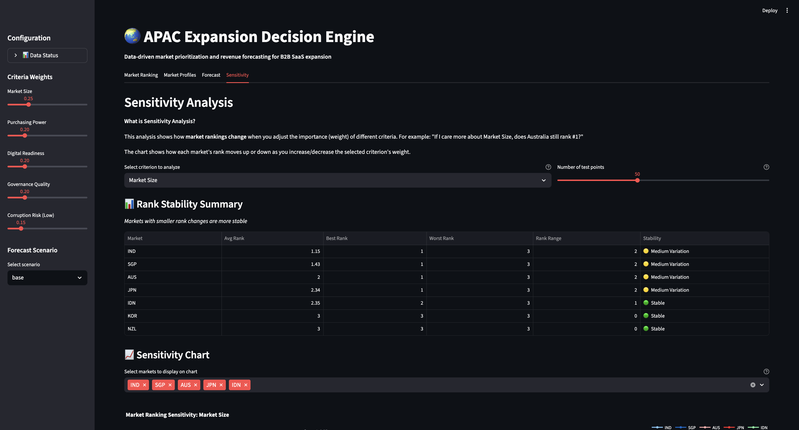
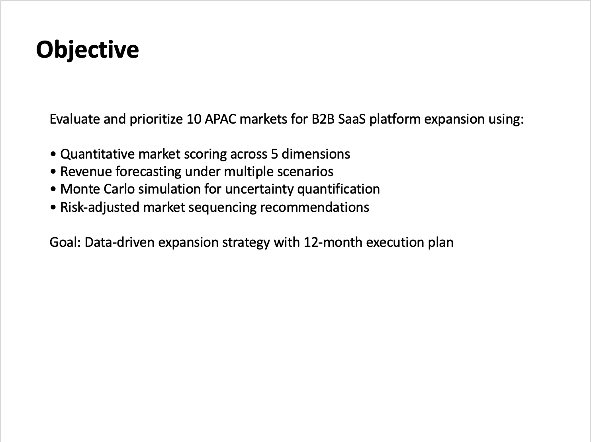

# APAC Market Expansion Decision Engine

## TL;DR

End-to-end decision support tool for APAC market entry that ranks expansion markets using public country-level indicators, standardised scoring, and Multi-Criteria Decision Analysis (MCDA) with configurable weights. Delivered via an interactive Streamlit dashboard plus exportable executive outputs (rank tables, sensitivity artefacts, and a slide deck).

Base-case Top 5 markets: AUS (0.460), SGP (0.454), JPN (0.272), KOR (0.234), NZL (0.123) (outputs/market_scores.csv)

Configurable weights (base): Market Size 25%, Purchasing Power 20%, Digital Readiness 20%, Governance Risk 20%, Corruption Risk 15% (config/weights.yml)

Driver transparency: component scores are exported per market; for AUS the largest positive contributors are Purchasing Power (+0.231), Governance Risk (+0.194), and Digital Readiness (+0.154), partially offset by Market Size (-0.120) (outputs/market_scores.csv)

Economics stress test: Monte Carlo simulation produces outcome distributions for the selected market under stated assumptions; under the current base assumptions, 12-month net revenue is negative on average and payback is not achieved within 12 months (outputs/monte_carlo_summary.csv, outputs/payback_distribution.csv)

Sensitivity / robustness: rankings are stress-tested in the dashboard using stored sensitivity artefacts (outputs/dashboard_data.pkl) to show when recommendations change as strategic priorities (weights) shift

---

## Case Study (Project 2): FrankieOne — Singapore GTM + Unit Economics

This repository includes a consulting-style case study that converts the market prioritisation engine into an executable market entry recommendation for a real APAC SaaS company.

**Client (case study):** FrankieOne (identity, fraud, and compliance orchestration)  
**Home market:** Australia  
**Recommended first non-home market:** Singapore

### Executive Deliverables
- **GTM Strategy Deck (PDF):** `FrankieOne_Singapore_GTM_Deck_SG.pdf`
- **Executive Memo (PDF):** `FrankieOne-Singapore-gtm.pdf`
- **Unit Economics Model (XLSX):** `frankieone_singapore_unit_economics.xlsx`

### What the case study covers
- Market choice grounded in the engine’s MCDA ranking and sensitivity results  
- ICP definition (regulated fintech/payments/digital banking) and compliance-led GTM motion  
- Unit economics at a fixed **$18,000 ACV** with CAC, churn, margin, and payback thresholds  
- 12-month execution plan with measurable KPIs

> Note: This is a hypothetical case study built for portfolio purposes and is not affiliated with FrankieOne.

---

## Overview

This repository contains an end-to-end decision support tool for prioritising market expansion opportunities across the Asia-Pacific (APAC) region. It is built for decisions where there is no single “right” answer, only trade-offs: opportunity vs. risk, growth vs. feasibility, and speed vs. certainty.

The tool pulls trusted public economic and governance indicators, transforms them into comparable features, and aggregates them into an overall market ranking using Multi-Criteria Decision Analysis (MCDA). To avoid false confidence from single-point rankings, it pairs base-case results with stress-testing via dashboard-based sensitivity exploration and a Monte Carlo revenue simulation for the top-ranked market. Outputs are packaged for decision-makers, including ranked score tables, simulation summaries, and an executive-style PowerPoint deck.

---

## Screenshots

### Dashboard: Market Ranking

*Interactive market ranking table with component scores and horizontal bar chart visualization.*

### Dashboard: Market Profiles

*Radar chart visualization showing market profile across five criteria (Purchasing Power, Market Size, Corruption, Governance, Digital Readiness) with key metrics.*

### Dashboard: Revenue Forecast

*Revenue forecasting with cumulative net revenue over 36 months, showing payback analysis and key metrics (Active Customers, Cumulative Revenue, Payback Status).*

### Dashboard: Sensitivity Analysis

*Sensitivity analysis showing how market rankings change when adjusting criterion weights, with rank stability summary table and interactive line chart.*

### Executive Deck: Objective Slide

*Executive PowerPoint slide outlining the objective and methodology for APAC market expansion analysis.*

---

## Business Problem

Companies expanding into new international markets face trade-offs between opportunity and risk. Market size, purchasing power, digital readiness, and governance quality all matter, but the importance of each depends on the organisation’s strategy and risk appetite.

This project addresses the question:

> *Which APAC markets should be prioritised for expansion, and how confident can we be in those recommendations given uncertainty in assumptions and weighting?*

---

## What This Produces

Running the pipeline generates decision-ready outputs in `outputs/`:

* **Market ranking and driver breakdown:** `market_scores.csv`
* **Simulation outputs:** `monte_carlo_results.csv`, `monte_carlo_summary.csv`
* **Payback outcomes:** `payback_distribution.csv`
* **Dashboard data (including sensitivity artefacts):** `dashboard_data.pkl`
* **Executive summary deck:** `apac_expansion_recommendations.pptx`

---

## How It Works

The project follows a consulting-style analytics workflow:

1. **Data collection**
   Pulls public country-level data from trusted international sources and caches downloads locally.

2. **Feature engineering**
   Converts raw indicators into comparable, standardised metrics so markets can be evaluated on a consistent basis.

3. **Multi-Criteria Decision Analysis (MCDA)**
   Aggregates multiple drivers into a single ranking using configurable weights.

4. **Sensitivity analysis (strategic priorities stress-test)**
   Explores how rankings change when weights are adjusted, helping distinguish robust recommendations from assumption-driven outcomes.

5. **Monte Carlo simulation (economics uncertainty stress-test)**
   Produces a distribution of 12-month outcomes for the top-ranked market under uncertainty in assumptions.

6. **Executive delivery**
   Provides an interactive dashboard for exploration and a PowerPoint deck for decision-makers.

---

## Methodology

### Scoring framework (MCDA)

Markets are evaluated across five criteria, each weighted in `config/weights.yml`:

* Market size
* Purchasing power
* Digital readiness
* Governance risk
* Corruption risk

The engine computes standardised component scores per criterion and aggregates them into a total score and final rank. Component scores are exported for transparency.

### Sensitivity analysis

Rather than treating weights as fixed, the dashboard explores how rankings shift under changes to strategic priorities. Sensitivity configuration is defined in `config/weights.yml` (including `step` and `runs`) and computed via the scoring module.

### Monte Carlo simulation

Monte Carlo simulation generates a 12-month distribution of outcomes for the top-ranked market under the current assumptions set. Results include mean/median and percentile bounds (e.g., P10/P90), plus payback outcomes.

---

## Data Sources

All data is sourced from reputable public datasets:

* **World Bank API**

  * GDP per capita
  * Population
  * Internet users (%)

* **Worldwide Governance Indicators (WGI)**

  * Regulatory quality
  * Rule of law

* **Our World in Data (OWID)**

  * Corruption Perceptions Index (CPI)

Downloaded data is cached locally to ensure reproducibility and reduce repeated API calls.

---

## Assumptions & Limitations

This tool is designed for **portfolio prioritisation**, not as a substitute for full commercial diligence.

* Country-level indicators can mask sector-specific realities (e.g., a strong digital score does not guarantee category fit).
* Governance and corruption indicators may be lagged and may not capture rapid shifts in policy or enforcement.
* The Monte Carlo model reflects the assumptions defined in `config/assumptions.yml`; results should be interpreted as “under these assumptions” rather than absolute forecasts.
* Current outputs show that, under the existing assumptions, payback is not achieved within 12 months for the top-ranked market. This is intentional: it forces assumptions to be made explicit and tested, rather than accepted by default.

---

## Project Structure

```text
.
├── src/
│   ├── data_sources/        # Data ingestion from public APIs
│   ├── features/            # Feature engineering and standardisation
│   ├── models/              # Scoring, forecasting, and simulation
│   ├── dashboards/          # Streamlit dashboard
│   └── reporting/           # PowerPoint generation
├── config/                  # Markets, weights, and business assumptions
├── data/
│   ├── raw/                 # Cached raw data
│   └── processed/           # Engineered features
├── outputs/                 # Final outputs and reports
├── tests/                   # Unit tests
├── README.md
└── requirements.txt
```

---

## Quick Start

### Installation

```bash
python -m venv .venv
source .venv/bin/activate
pip install -r requirements.txt
```

### Run the Full Pipeline

```bash
python -m src.main
```

This will download data, build features, score markets, run simulations, and generate the outputs in `outputs/`.

### Launch the Dashboard

```bash
streamlit run src/dashboards/app.py
```

---

## Configuration

All key assumptions are configurable:

* `config/markets.yml` – markets included in the analysis
* `config/weights.yml` – criteria weights and sensitivity parameters
* `config/assumptions.yml` – business and revenue assumptions

This allows the same framework to be reused across different strategic contexts without code changes.

---

## Interpreting the Results

A practical way to use the tool:

1. **Shortlist markets using the base-case ranking** (`market_scores.csv`).
2. **Check explainability** by reviewing the component breakdown (what is driving the score).
3. **Stress-test with sensitivity** (dashboard) to see which recommendations survive changing priorities.
4. **Stress-test economics** using Monte Carlo distributions and payback outputs for the top-ranked market.
5. **Translate to action** using the generated executive deck as the starting point for a market entry plan.

---

## Roadmap

Potential extensions to increase realism and applicability:

* Sector-specific scoring modules (e.g., SaaS vs retail vs fintech)
* Additional indicators (trade openness, logistics performance, inflation, FX volatility)
* Export sensitivity outputs to CSV for easier external reporting
* Back-testing against historical expansion outcomes
* Optional “go-to-market” module to generate launch planning artefacts per chosen market

---

## Intended Use

This project was built as a strategy and analytics exercise and is intended for:

* Consulting and strategy roles
* Market entry and international expansion analysis
* Decision-making under uncertainty
* Portfolio prioritisation problems

---

## Author

**Adam Lababidi**
Electrical Engineering student with a strong interest in strategy, analytics, and data-driven decision-making.
